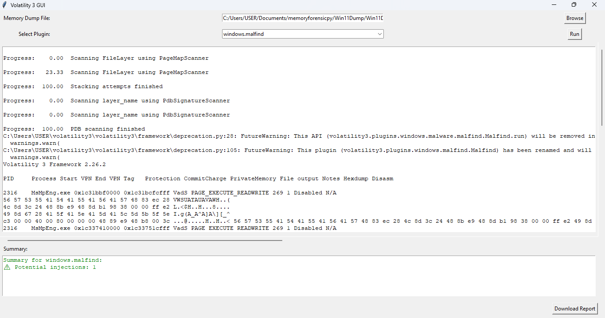

# Volatility3-gui

# 🧪 Volatility3 GUI (Tkinter-Based Memory Forensics Tool)

This is a simple Python GUI built on top of [Volatility3], a memory forensics framework. It helps security analysts quickly run Volatility3 plugins without needing the command line.

---

## 🖥️ Features

- Select memory dump files easily
- Choose from available Volatility3 plugins
- View plugin results in a readable text area
- See a quick summary of key findings
- Save the output to a text file (optional)

---

## 📸 Screenshot



---

## ⚙️ Requirements

- Python 3.8+
- Volatility3 installed and in your `PYTHONPATH`
- Tkinter (comes with most Python distributions)

You can install required packages via:

```bash
pip install volatility3
